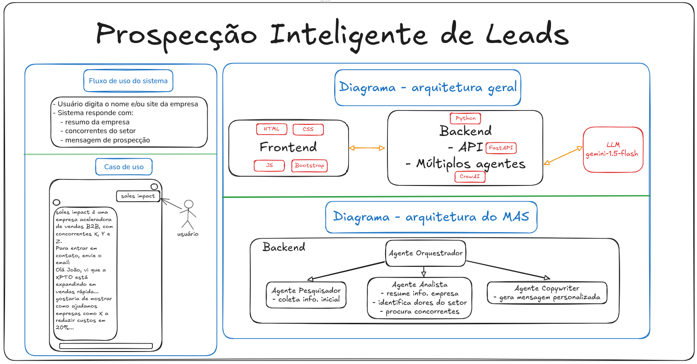

# Prospecção Inteligente de Leads 🚀
Este projeto é um **MVP** desenvolvido para demonstrar o uso de **agentes de IA** generativa aplicados à **prospecção inteligente de leads**.

A solução coleta informações sobre empresas, analisa concorrência e gera uma mensagem de prospecção personalizada para **apoiar times de vendas**.

## 📌 Funcionalidades do MVP
**Entrada**: nome ou site da empresa.

**Saída**: Resumo da empresa, Concorrentes do setor e Mensagem de prospecção personalizada

## 🏗️ Arquitetura


### Frontend
HTML, CSS, JS e Bootstrap → formulário simples para interação.

### Backend (Python)
- FastAPI → expõe a API REST.
- CrewAI → orquestração multi-agentes.
- Gemini (Google Generative AI) → LLM utilizada para resumo e copywriting.
- Serper API → usada para pesquisa de informações externas (ex.: concorrentes).

### Agentes
- 🔎 Pesquisador → coleta informações iniciais da empresa.
- 📊 Analista → resume informações e identifica concorrentes.
- ✍️ Copywriter → gera mensagem de prospecção personalizada.
- 🎯 Consolidador → consolida e administra a saída dos demais agentes.

### ⚙️ Tecnologias utilizadas
- Python 3.12+
- FastAPI
- CrewAI
- Google Generative AI SDK (Gemini)
- Serper API
- Bootstrap 5

## 📂 Estrutura do Projeto
``` bash
.
├── backend
│   ├── agents
│   │   └── config
│   ├── core
│   ├── endpoints
│   ├── schemas
│   ├── services
│   └── tests
│       ├── http_requests
│       └── unit
├── docs
└── frontend
    ├── assets
    ├── scripts
    └── styles
```

## 🔑 Variáveis de Ambiente
Crie um arquivo `.env` dentro de `backend/` baseado em [`.env.example`](backend/.env.example):
``` bash
GEMINI_API_KEY=your_gemini_api_key
SERPER_API_KEY=your_serper_api_key
```

## ▶️ Como rodar o projeto
1. Clonar repositório:
``` bash
git clone https://github.com/gustavo-rmontes/sales-agents-sys.git
cd sales-agents-sys/backend
```

2. Instalar dependências com uv:
``` bash
uv sync
```

3. Rodar o backend:
``` bash
uv run main.py
```

O backend estará disponível em: http://127.0.0.1:8000

4. Rodar o frontend

Abra o arquivo `frontend/index.html` diretamente no navegador.